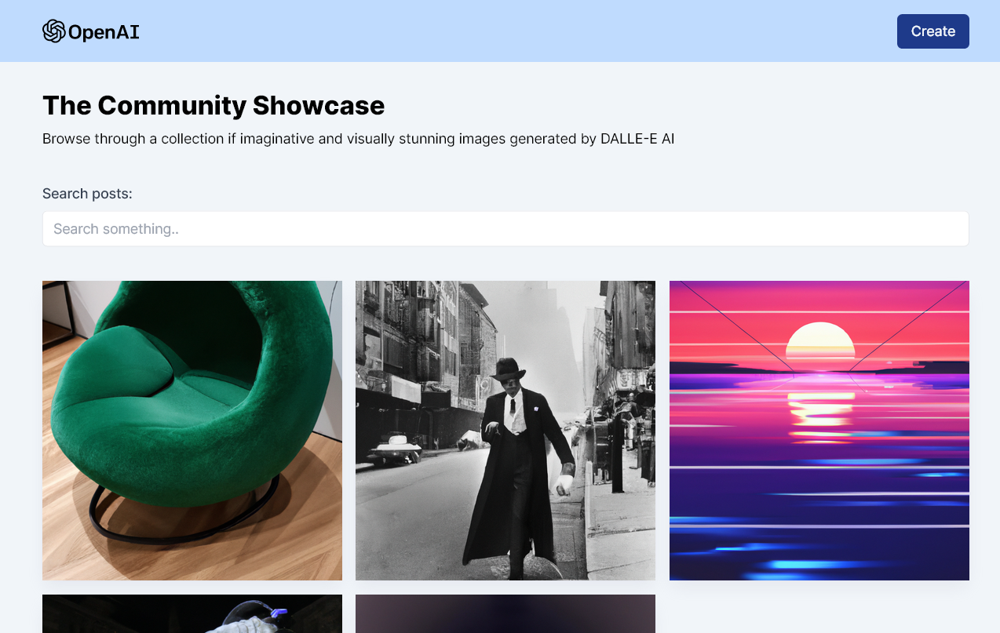

# AI Image Generation



On the homepage, users can view the gallery of AI-generated images that are created based on user input prompts. Hovering each image reveals the user and prompt that were used to generate it. Users can even download the images they like! Users also can search images to find specific images based on the keywords. If you are feeling creative, you can try generating your own images on the create page by typing a name and a prompt or clicking the "surprise me" button for a random prompt. Lastly, click the generate button! Like the image? Let's share with the community!

Users should be able to do:

- [x] Users can view the gallery of AI-generated images on the homepage
- [x] Users can search images based on the keyword
- [x] Users can go to the create page to type their name and prompt or click the surprise me button
- [x] Users can generate images as long as both inputs are filled
- [x] Users can re-generate the image if they dislike
- [x] Users can share the generated image with the community

[View the live site here - client](https://ai-image-generation-sandy.vercel.app/)

[View the API site here - server](https://ai-image-generation-ixl2.onrender.com/api/v1/posts)

## Tech Stack

      

## Screenshots/GIFs

## Screenshot/GIFs

<details close>
<summary>Overall Demo</summary>

Each image will show what prompt was used to create, the submitted name, and a download image button when hovering.

https://user-images.githubusercontent.com/35031228/227278329-7d7d2043-2de2-4979-a532-dc6f488fc06a.mp4

</details>

<hr />

<details close>
<summary>Search Demo</summary>

https://user-images.githubusercontent.com/35031228/227278333-259efb5b-061b-4077-8c14-d189f7af4e14.mp4

</details>

<hr />

<details close>
<summary>Create an AI-generated Image based on the prompt</summary>

If dislike the first generated image, can click the generate button and then sharing with the community!

https://user-images.githubusercontent.com/35031228/227278335-d7190e68-19e2-4202-9b87-0466b9bf4ecf.mp4

</details>

<hr />

## Installation

```bash
git clone git@github.com:victoriacheng15/ai-image-generation.git
```

```bash
cd ai-image-generation
```

```bash
# or your preference for the package
pnpm install

cd client && pnpm install

cd server && pnpm install
```

Change `.env.example` to `.env` in client and server folders

```js
// client/.env
VITE_BACKEND = "your backend url";

// server/.env
MONGO_URI = "mongoDB url";
OPENAI_API_KEY = "your personal setting -> API keys";

CLOUDINARY_CLOUD_NAME = "your dashboard page -> Cloud Name";
CLOUDINARY_API_KEY = "your dashboard page -> API key";
CLOUDINARY_API_SECRET = "your dashboard page -> API Secret";
```

```bash
# root folder
pnpm start
```

## What I have learned

**API versioning**

I stomped upon this article about [REST API design best Practices Handbook](https://www.freecodecamp.org/news/rest-api-design-best-practices-build-a-rest-api/) by Jean-Marc Möckel while working on this app. Originally, I had all routes and controllers under the `src` folder and was thinking what if the API is improved in the future, how would I keep the 1st version while working on the 2nd version? The blog explains how to do this. Setting up `v1` folder under the `src` folder and moving `routes` and `controllers` folders to the `v1`. This way, I can keep v1 alive while working on v2 with improved features or similar.

**try-catch-finally**

I have not used the `finally` block before until this app. The code will run the `try` block first. If an error exists, the `catch` block will run. If there is no error from the code in `try` block, the `finally` block will run. I utilized this for set status back to `false` for `setLoading` and `setGeneratingImg` after fetching `GET` and `POST` requests successfully.

[try...catch - MDN Docs](https://developer.mozilla.org/en-US/docs/Web/JavaScript/Reference/Statements/try...catch)

## Future Development

- Migrate the backend from JavaScript to TypeScript
- Display warnings under the input fields instead of using `alert`

## Source

This is based on the [MERN AI Image Generation App (Midjourney & DALL-E Clone)](https://www.youtube.com/watch?v=EyIvuigqDoA&t=5202s) by JavaScript Mastery. This video wrote this app with JavaScript, however, I wrote the frontend with TypeSCript and looking to migrate the backend to TypeScript as mentioned above.

## Author

[](https://www.linkedin.com/in/victoriacheng15/) [](https://twitter.com/viktoriacheng15)
